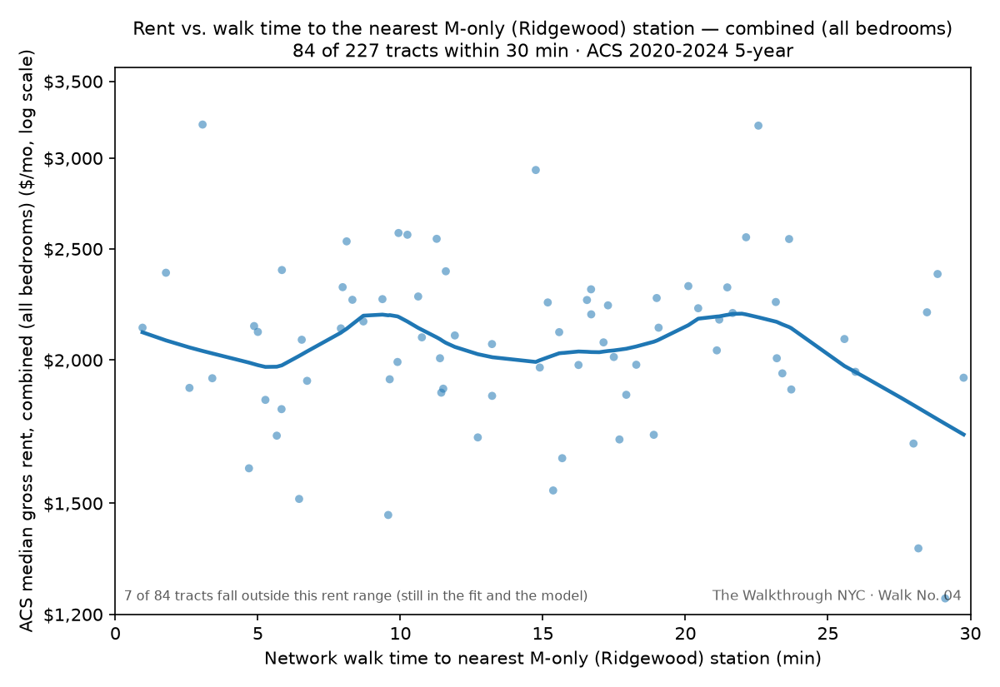

# Walk No. 04 — The Ridgewood Rent Premium

**Status: in progress** — model complete: rent rises the closer you get to Ridgewood's M-only stations, a real and robust finding · walk **Sat Sep 26**, meets at the Seneca Ave (M) station · [RSVP](https://luma.com/yd7jpq91)

Part of [The Walkthrough NYC](https://thewalkthroughnyc.substack.com/), a public math walk series: publish a question, build the analysis in the open, then test the finding with strangers on a sidewalk.

## The finding

| | |
|---|---|
| Rent vs. distance into Ridgewood (nearest M-only station) | **−0.43% to −0.62% per minute — strongly significant in every bedroom size (t = −3.9 to −5.3)** |
| Total accessibility premium within a 20-minute walk of an M-only station | **≈ $79 million a year — 69,047 renter households paying ~$96/month more than they would 20 minutes out** |



## The question

Rent rises the closer you get to the M-only stations clustered in
Ridgewood and Middle Village — Central Av, Knickerbocker Av, Forest Av,
Fresh Pond Rd, Middle Village-Metropolitan Av, Seneca Av. That premium is
real, strongly significant, and holds the same way across every bedroom
size. This piece is about that gradient: how big it is, how far it
reaches, and who's already pricing it in.

## Data & sample frame

Every choice below is a modeling decision, stated before pulling, per house rules.

- **Unit of analysis: census tract.** Outcome is **ACS 2020–2024 5-year median gross rent** (table B25064, plus B25031 split by bedroom count) — public, reproducible, and covering what people actually pay rather than only what's listed. Margins of error are pulled alongside and used to flag low-reliability tracts (CV > 30%).
- **Geography: a 1.25-mile band spanning Brooklyn and Queens, covering Ridgewood, Middle Village, and the surrounding blocks.** <!-- Jordan: this rationale is yours from the Sep 7 notes — rephrase in your voice --> The band crosses the county line by design — a Kings-only pull would have silently clipped out the Ridgewood tracts, which turned out to be the whole finding.
- **Distance is network walk time, not straight-line** — OSMnx pedestrian network, tract internal point to the nearest station, at 80 m/min. The Bushwick street grid and the Cemetery of the Evergreens make crow-flies and on-foot diverge sharply; that divergence is much of the point.
- **Stations are split by service tier.** The M-only stations — Ridgewood/Middle Village, the tier that matters — lose through-service to Manhattan overnight, cut back to a Middle Village–Myrtle Av shuttle. Everything else (full-service lines, including the Myrtle-Wyckoff Avs transfer complex) is a control, not the subject.
- **Exclusions:** tracts with no rent estimate (ACS jam values), and tracts with fewer than 100 renter households — cemeteries and industrial land where a "median rent" is noise. Every rule and its cost in rows is machine-logged to [`outputs/cleaning_log.md`](outputs/cleaning_log.md).

## Method

```
ln(rent_i) = β₀ + β₃·walkRidgewood_i + controls + ε_i
```

**β₃ — walk time to the nearest M-only Ridgewood station — is the number that matters.** Strong and significant across every bedroom size, described in plain terms rather than a half-life, since those stations are clustered in one corner of the map rather than spread evenly through the sample. (The full regression also holds other nearby-station distances fixed as controls — see `src/lib.py::fit_model` — but none of them carry a reliable signal on their own; the Ridgewood term is the entire finding.)

Logs, because the premium is proportional — a station matters in percent of rent, not fixed dollars, and a β×100 reads directly as percent per walk minute. Controls: median year built, median rooms, renter share, unit-mix shares. HC1 robust standard errors.

**This is a descriptive accessibility gradient, not a causal estimate.** Station locations and neighborhood change are entangled; the cross-section can't separate them.

## Reproduce

```bash
pip install -r requirements.txt
export CENSUS_API_KEY=...   # free + instant: https://api.census.gov/data/key_signup.html
make pull        # 01: band, tracts, ACS rent (blended + per-bedroom) → prints Gate 1
make walktimes   # 02: OSMnx walk times by station tier
make clean_join  # 03: cleaning log + two charts per series → prints Gate 2
make model       # 04: fits the model — the Ridgewood coefficient is the headline number
make test        # offline tests on the transforms

BAND_SPINE=M make all   # robustness: redraw the band around the M's own run instead;
                        # outputs get a _mspine tag and sit alongside the originals
```

Raw downloads cache to `data/raw/` (gitignored); everything derived is regenerated by the scripts.

## Repo map

```
src/           config.py (every knob) · lib.py (tested logic) · 01–04 (the pipeline)
tests/         offline tests, incl. simulated-data recovery of a planted β
data/          raw/ (cached downloads, gitignored) · processed/ (committed, small)
outputs/       figures/ · cleaning_log.md · tool/coefficients.json → feeds the p5 sketch
walk/          route.md · packet.md · script.md — the sidewalk layer, starts at Seneca Ave
```

## Honest limitations

- ACS medians average 2020–2024 and include rent-stabilized units, so the gradient here is likely **flatter** than the asking-rent gradient a mover faces today. If anything, this underestimates the premium.
- Median gross rent is top-coded (~$3,500+); tracts at the cap are flagged, and 3BR tracts hit the cap far more often than 1BR (~13% vs ~3%), as you'd expect from bigger units costing more.
- Tract internal points are geometric, not population-weighted; block-weighted centroids are the known upgrade.
- Stations are points, not entrances; at tract resolution the difference is noise, but it's a real simplification.
- Neighboring tracts aren't independent. HC1 doesn't fix spatial autocorrelation; treat the SEs as friendly.
- The combined series blends every bedroom count into one tract-level median; the 1BR/2BR/3BR cuts address that directly, but each has a thinner, noisier sample than the combined series (a subgroup within a tract has fewer surveyed households, so more tracts get dropped or flagged low-reliability).
- The Ridgewood gradient is the strongest signal in the model, but the M-only stations are geographically clustered in one corner of the sample. That makes it hard to separate "closer to a weaker-service line" from "closer to Ridgewood specifically" — the gradient may reflect the neighborhood's own price dynamics as much as anything about that particular train. The walk's east/west bearings are designed to probe exactly this, live.
- Restricting to tracts within a realistic 30-minute walk of an M-only station makes the raw correlation look *stronger*, but the full controlled model loses statistical power there — three of the four bedroom sizes stop being significant once the sample shrinks that much. The full sample's result is the one that's actually reliable and consistent across every series; the realistic-range version is a caveat worth mentioning, not a replacement number.
- Within the cluster, rent isn't uniform — it runs highest at the Bushwick/Ridgewood end (around Central Av, ~$2,300 median) and falls going deeper into Queens (Forest Av, Fresh Pond Rd, ~$1,900). A single "distance to the nearest M-only station" term treats every M-only station alike and doesn't capture that west-to-east slope; the model over-predicts rent at the Queens end by roughly $150–200.
- The sample band was drawn around a corridor spine that runs along the L, not the M; its reach into Queens is what captures Ridgewood. Redrawing the band around the M's own run (`BAND_SPINE=M`) halves the sample (113 usable tracts vs. 227) and collapses the contrast — median walk to the nearest M-only station falls from 44 minutes to 18, so nearly every tract sits at the "near" end. Point estimates go the same direction and get larger (−0.82%/min combined), but none of the four series is significant there (t = −1.6 to −1.9; 3BR flips sign). We read that as consistent but underpowered, not as a failed replication: the original band's power comes from containing the far-from-M tracts that give the gradient something to be measured against. The headline stands on the original sample.

## The walk

Sat Sep 26, ~90 minutes, starting at the **Seneca Ave (M)** station entrance — the middle of the M-only cluster, where the finding lives. Four teams, four directions:

- **North, toward Middle Village** (Forest Av, Fresh Pond Rd) — the deeper-into-Queens end of the cluster. The data says rent falls this way, from roughly $2,080 around Seneca to $1,910 around Fresh Pond Rd.
- **South, toward Myrtle-Wyckoff Avs** — the Bushwick/Ridgewood end of the cluster. The data says rent rises this way, slightly — roughly $2,080 to $2,130 — and keeps rising past Myrtle-Wyckoff toward Central Av (~$2,300), the most expensive stretch of the line.
- **East and west, perpendicular to the M line** — tests whether this is really about that specific train, or just about being in Ridgewood generally. No prediction from the data; this is the live experiment.

Each team predicts a rent *before* looking anything up — anchored on their own housing (their own bedroom count, their own rent, their own walk to a subway), not a hypothetical bedroom size, since the finding holds the same way regardless of unit size. We regroup to plot everyone's guesses against the model on one chart, live.

**[RSVP for the walk.](https://luma.com/yd7jpq91)**

The closing question: if proximity to a subway station generates a
premium — who captures it?
