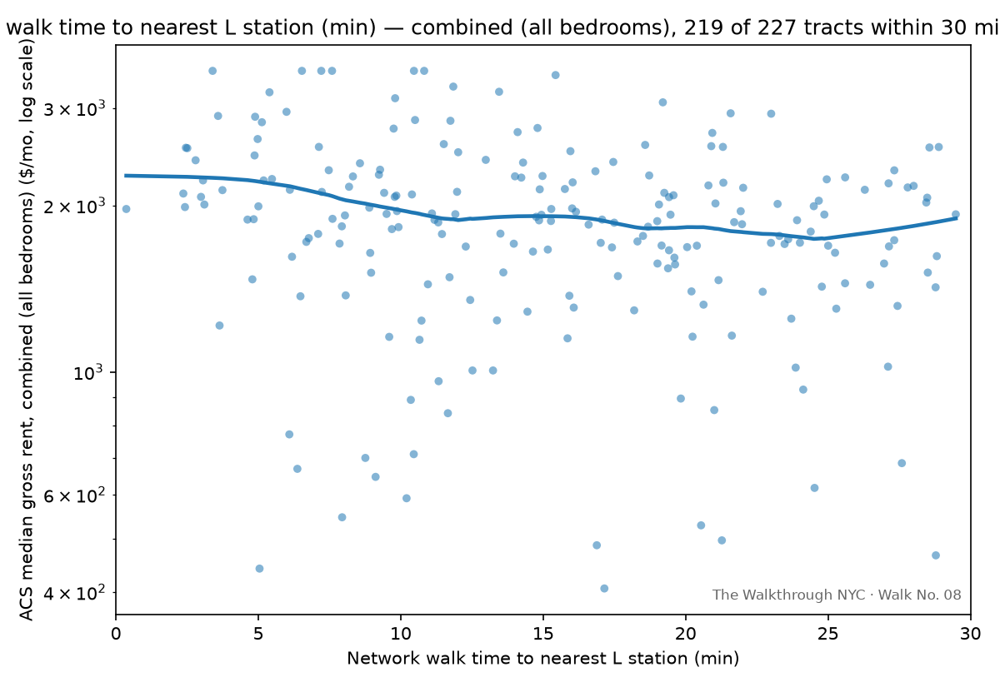

# Walk No. 08 — How much of your rent is the walk to the L?

**Status: in progress** — question published Aug 31 · model complete, the answer turned out to be about Ridgewood, not the L · walk **Sat Sep 26**, meets at the Seneca Ave (M) station. <!-- Jordan: add the Luma RSVP link here and at the bottom -->

Part of [The Walkthrough NYC](https://example.substack.com) <!-- Jordan: real link -->, a public math walk series: publish a question, build the analysis in the open, then test the finding with strangers on a sidewalk.

## The finding

| | |
|---|---|
| Rent vs. walk time to *the L*, alone | No reliable effect once controls are added — β₁ ≈ −0.2%/min, not statistically significant, consistent across all four bedroom sizes (combined/1BR/2BR/3BR) |
| Rent vs. distance into Ridgewood (nearest M-only station) | **−0.43% to −0.62% per minute — strongly significant in every bedroom size (t = −3.9 to −5.3)** |
| Total accessibility premium in the catchment vs. what the public recovered | *(open — see note)* |

<!-- Jordan: the clean "walk to the L" half-life didn't survive once walk_nonL_min and
the M-only Ridgewood stations got separated out from the rest of non-L service — the
real, robust signal turned out to be distance into Ridgewood specifically, not distance
to the L. The "total premium" row above is still open: it was going to be built from the
L-specific β₁, which isn't reliable enough to extrapolate from — decide whether to build
it off the Ridgewood gradient instead, or drop the row. Full numbers per series in
outputs/model_summary*.txt and outputs/tool/coefficients*.json. -->




## The question

The original premise: rent near the subway is higher, and the closer you are to
the L specifically, the more you pay. That's not what happened. Once you
control for distance to every other nearby train and for basic differences in
the housing stock (building age, unit size, renter share), distance to the L
doesn't predict rent at all — anywhere, in any bedroom size.

What does predict it: distance to the M-only stations clustered in
Ridgewood and Middle Village — Central Av, Knickerbocker Av, Forest Av,
Fresh Pond Rd, Middle Village-Metropolitan Av, Seneca Av. Rent **rises**,
not falls, as you approach them. So the real question this piece answers
isn't about the L. It's: why does the neighborhood around the *weaker*
train command a premium the corridor along the *better* one doesn't?

## Data & sample frame

Every choice below is a modeling decision, stated before pulling, per house rules.

- **Unit of analysis: census tract.** Outcome is **ACS 2020–2024 5-year median gross rent** (table B25064, plus B25031 split by bedroom count) — public, reproducible, and covering what people actually pay rather than only what's listed. Margins of error are pulled alongside and used to flag low-reliability tracts (CV > 30%).
- **Geography: a 1.25-mile band around the L corridor from Bedford Av to Canarsie–Rockaway Pkwy, both sides — not just the tracts on the spine.** The L runs the corridor's length, so *along* the line there is almost no variation in walk time; the variation that identifies a gradient runs *perpendicular* to it. A spine-only sample would have nothing to estimate on. <!-- Jordan: this rationale is yours from the Sep 7 notes — rephrase in your voice -->
- **The band crosses the county line.** North of the Wyckoff Av stretch is Ridgewood, and across Newtown Creek is Maspeth — both Queens. The pull covers **Kings and Queens counties**; a Kings-only pull silently clips the north half of the sample — which turned out to be where the actual finding lives.
- **Distance is network walk time, not straight-line** — OSMnx pedestrian network, tract internal point to the nearest station, at 80 m/min. The Bushwick street grid and the Cemetery of the Evergreens make crow-flies and on-foot diverge sharply; that divergence is much of the point.
- **Non-L service is split into two tiers**, not treated as one group: full-service stations (A/C/J/Z, and the Myrtle-Wyckoff Avs L+M complex), and stations where the M is the *only* route — which also loses through-service to Manhattan overnight, cut back to a Middle Village–Myrtle Av shuttle. Only the second tier turned out to matter.
- **Exclusions:** tracts with no rent estimate (ACS jam values), and tracts with fewer than 100 renter households — cemeteries and industrial land where a "median rent" is noise. Every rule and its cost in rows is machine-logged to [`outputs/cleaning_log.md`](outputs/cleaning_log.md).

## Method

```
ln(rent_i) = β₀ + β₁·walkL_i + β₂·walkNonL_i + β₃·walkLimited_i + γ·X_i + ε_i
```

Logs, because the premium is proportional — a station matters in percent of rent, not fixed dollars, and a β×100 reads directly as percent per walk minute. `walkNonL` is split into two tiers: full-service non-L stations, and stations where the M is the *only* route (the Ridgewood/Middle Village stretch — see `config.py`'s `LIMITED_SERVICE_ROUTES`). Controls X: median year built, median rooms, renter share, unit-mix shares. HC1 robust standard errors.

**β₁ (the L) isn't reliable. β₃ (the Ridgewood M-only tier) is** — strong and significant across every bedroom size. That's the headline number now, described in plain terms rather than a half-life, since the M-only stations are clustered in one corner of the map rather than spread through the band the way the L is.

**This is a descriptive accessibility gradient, not a causal estimate.** Station locations and neighborhood change are entangled; the cross-section can't separate them. (Walk No. 09's candidate design — the L shutdown as difference-in-differences — is where identification lives.)

## Reproduce

```bash
pip install -r requirements.txt
export CENSUS_API_KEY=...   # free + instant: https://api.census.gov/data/key_signup.html
make pull        # 01: band, tracts, ACS rent (blended + per-bedroom) → prints Gate 1
make walktimes   # 02: OSMnx walk times, 3-way split (L / full non-L / M-only)
make clean_join  # 03: cleaning log + two scatters per series → prints Gate 2
make model       # 04: β for walk_L_min AND walk_limited_min, per series
make test        # offline tests on the transforms
```

Raw downloads cache to `data/raw/` (gitignored); everything derived is regenerated by the scripts.

## Repo map

```
src/           config.py (every knob) · lib.py (tested logic) · 01–04 (the pipeline)
tests/         offline tests, incl. simulated-data recovery of a planted β₁
data/          raw/ (cached downloads, gitignored) · processed/ (committed, small)
outputs/       figures/ · cleaning_log.md · tool/coefficients.json → feeds the p5 sketch
walk/          route.md · packet.md · script.md — the sidewalk layer
```

## Honest limitations

- ACS medians average 2020–2024 and include rent-stabilized units, so the gradient here is likely **flatter** than the asking-rent gradient a mover faces today. If anything, this underestimates the premium.
- Median gross rent is top-coded (~$3,500+); tracts at the cap are flagged, and 3BR tracts hit the cap far more often than 1BR (~13% vs ~3%), as you'd expect from bigger units costing more.
- Tract internal points are geometric, not population-weighted; block-weighted centroids are the known upgrade.
- Stations are points, not entrances; at tract resolution the difference is noise, but it's a real simplification.
- Neighboring tracts aren't independent. HC1 doesn't fix spatial autocorrelation; treat the SEs as friendly.
- The combined series blends every bedroom count into one tract-level median; the 1BR/2BR/3BR cuts address that directly, but each has a thinner, noisier sample than the combined series (a subgroup within a tract has fewer surveyed households, so more tracts get dropped or flagged low-reliability).
- The Ridgewood/M-only gradient is the strongest signal in the model, but M-only stations are geographically clustered in one corner of the band. That makes it hard to separate "closer to a weaker-service line" from "closer to Ridgewood specifically" — the gradient may reflect the neighborhood's own price dynamics as much as anything about that particular train. The walk's east/west bearings are designed to probe exactly this, live.
- Restricting to tracts within a realistic 30-minute walk of an M-only station makes the raw correlation look *stronger*, but the full controlled model loses statistical power there — three of the four bedroom sizes stop being significant once the sample shrinks that much. The full-band result is the one that's actually reliable and consistent across every series; the realistic-range version is a caveat worth mentioning, not a replacement number.

## The walk

Sat Sep 26, ~90 minutes, starting at the **Seneca Ave (M)** station entrance — not DeKalb Av, once the data pointed at Ridgewood instead of the L. Seneca Ave sits roughly in the middle of the M-only cluster. Four teams, four directions:

- **North, toward Middle Village** — stays inside the M-only cluster. Tests whether the premium holds steady or varies within Ridgewood itself.
- **South, toward Myrtle-Wyckoff Avs** — leaves the M-only cluster for a full L+M station. Should show rent falling as the walk leaves Ridgewood's isolation behind.
- **East and west, perpendicular to the M line** — tests whether this is really about that specific train, or just about being in Ridgewood generally.

Each team predicts a rent *before* looking anything up — anchored on their own housing (their own bedroom count, their own rent, their own walk to a subway), not a hypothetical bedroom size, since the finding holds the same way regardless of unit size. We regroup to plot everyone's guesses against the model on one chart, live. <!-- Jordan: RSVP link, and the closing question — "the L created this premium, who's collecting it" doesn't fit anymore since the finding isn't about the L. Your call on the replacement; substack_post.md has a couple of draft directions. -->
