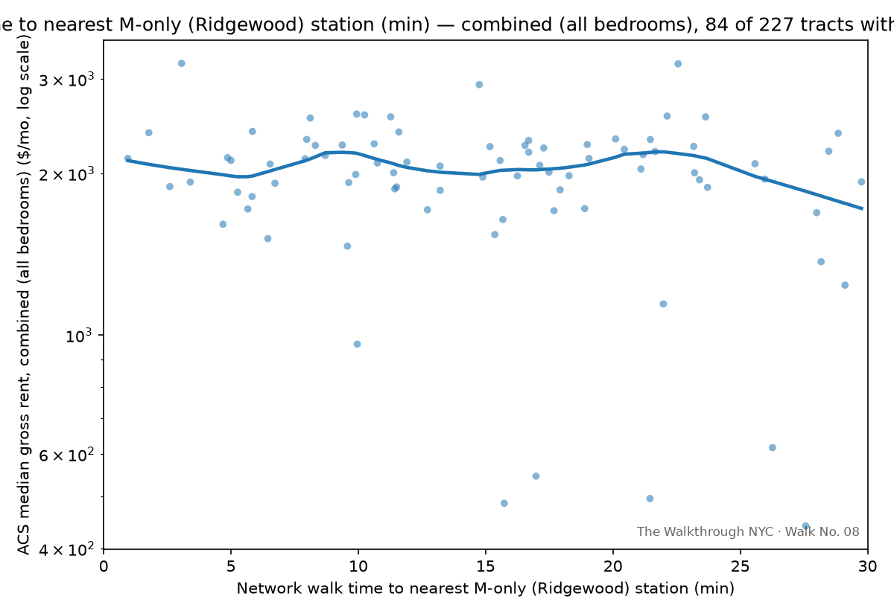

# How much of your rent is the walk to the L?

<!-- DRAFT — full first pass, written by Claude for Jordan to rework. Every
sentence here is a placeholder for your own voice. Real numbers, real
structure, not real prose yet. -->

You get off the L at DeKalb Av, and you start doing the math everyone in
this neighborhood does without noticing: *if I lived one block closer, what
would that cost me?* It's a question about a train, but it's really a
question about money — how much of your rent is actually the walk.

So I tried to answer it properly. Median rent, from the Census, for every
tract in a mile-and-a-quarter band running along both sides of the L, from
Bedford Av out to Canarsie. Real walking routes, not straight lines —
OSMnx routes every tract's actual sidewalk distance to the nearest station,
because a look at a map of the Cemetery of the Evergreens will tell you why
"as the crow flies" is the wrong tool here. 240 tracts, cleaned down to 227
usable ones once you throw out the places with no reliable rent estimate
or too few renters to trust a median.

Here's what I expected: rent falls off the closer you get to any other
train, and it decays as you walk away from the L, cleanly, like a radio
signal getting weaker. Here's what the data actually said.

## The L, on its own, doesn't hold up

Once you control for distance to every other nearby train and for basic
differences in the housing itself — building age, unit size, how many
units are renter- vs. owner-occupied — walking distance to the L stops
being a reliable predictor of rent. Not "the effect is small." Statistically,
it's not distinguishable from zero. Same result whether you look at the
blended market or split it out by 1BR, 2BR, and 3BR specifically.

That's not a failed analysis — it's a real finding. My best read: in a
housing market this tight, people don't get to be picky about *which*
train, just whether there's one nearby at all. <!-- Jordan: this is your
vacancy-rate theory from our conversation — rewrite in your own words,
and flag clearly that it's a theory, not something the data proves. -->

## Ridgewood is the actual story

Here's the part that surprised me. I split "every other train" into two
groups: full-service lines (the A, C, J, Z), and the M — which, on its
Ridgewood/Middle Village stretch, is the *only* train, and even gets cut
back to a shuttle overnight, no through service to Manhattan at all.

Distance to a full-service station: no reliable effect, same as the L.

Distance to the nearest M-only station: a real, strong, consistent signal.
Not "closer to the M is a little more expensive." Rent rises noticeably —
somewhere between 0.43% and 0.62% per walk-minute closer, depending on
bedroom count — and it holds up whether I'm looking at the blended market
or 1BR/2BR/3BR separately. Of everything I tested, this is the one
relationship the data would not let go of.

Which means the honest version of "how much of your rent is the walk to
the L" is: *it isn't.* It's the walk to Ridgewood.

<!-- Jordan: your theory here — Ridgewood gentrifying faster than Bushwick,
landlords pricing to it — goes in this paragraph, in your words, clearly
marked as your read rather than a proven mechanism. -->

## What this can't tell you

- This is one snapshot in time, one city. It shows a relationship, not a
  cause — the L shutdown (Walk No. 09) is where I'd actually go looking for
  causation.
- The M-only stations are all bunched in one corner of the map. So "closer
  to a weaker train" and "deeper into Ridgewood" are almost the same
  variable here — I can't fully separate a train-quality story from a
  neighborhood-identity one.
- ACS rent estimates are five-year averages that include rent-stabilized
  units, so if anything, the real gradient a mover faces today is probably
  steeper than what shows up here.

## Test it yourself, Sept 26

<!-- Jordan: your RSVP link and closing question go here. Given the finding
changed, "the L created this premium, who's collecting it" doesn't quite
fit anymore — maybe something closer to "the premium isn't near the train
everyone assumes, it's in the neighborhood everyone's just started
noticing — who's capturing that?" Your call; this is the actual thesis of
the walk. -->

We'll meet at the **Seneca Ave (M)** entrance — not DeKalb, once the data
pointed at Ridgewood instead of the L — split into teams, and walk four
directions from there. You'll guess a rent before you look anything up —
anchored on your own home, your own bedroom count and rent and walk to a
subway, not a hypothetical. Then we'll put everyone's guesses on one
chart next to what the data actually says, live, on the sidewalk.

